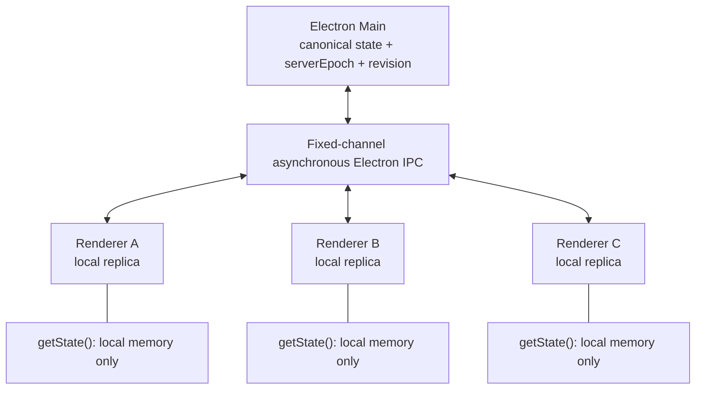
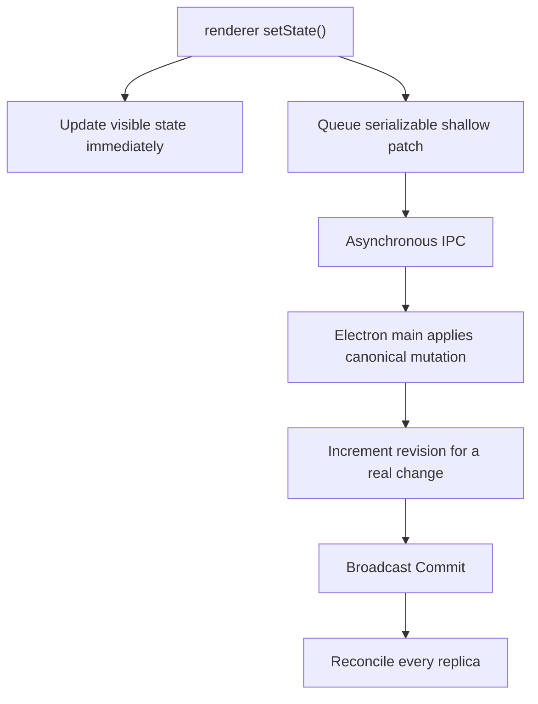

# electron-sync-store

Synchronous local state with IPC-backed replication for Electron.

`electron-sync-store` gives Electron main and renderer processes one logically
shared typed store. Main owns canonical state and revision ordering. Every
renderer keeps a local replica, so hydrated `getState()` calls and optimistic
`setState()` calls are synchronous and never use synchronous IPC.

## Why

Electron applications often need shared state in main and several isolated
renderer processes. Requesting every read over IPC is asynchronous and awkward,
while exposing `ipcRenderer` or disabling context isolation weakens security.
This library provides a narrow protocol, local renderer replicas, deterministic
canonical ordering, and recovery from missed or uncertain messages.

## Features

- Zustand-like `getState()`, `setState()`, and `subscribe()`
- Synchronous optimistic renderer writes
- Canonical main-process state, revisions, and `serverEpoch`
- Ordered pending-patch rebasing
- Mutation deduplication and explicit no-op acknowledgments
- Rejection rollback, revision-gap recovery, epoch recovery, and bounded retry
- `flush()` synchronization barrier
- Context-isolated preload bridge with fixed IPC channels
- React selectors through `useSyncExternalStore`
- Electron-independent core, canonical-store, and renderer tests

## Installation

Install only the packages your process uses:

```sh
pnpm add @electron-sync-store/main @electron-sync-store/renderer
pnpm add @electron-sync-store/react react
```

Electron is a peer dependency of the main and renderer packages. React is a
peer dependency of the React adapter.

## Quick start

### Main process

```ts
import { createElectronSyncMain } from "@electron-sync-store/main";

interface AppState {
  counter: number;
  profile: { name: string };
}

const sync = createElectronSyncMain();
const store = sync.createStore<AppState>("app", {
  counter: 0,
  profile: { name: "Anish" },
});

const installation = sync.installElectron();

// Main uses the same canonical revision stream.
store.setState((state) => ({ counter: state.counter + 1 }));
```

Call `installation.uninstall()` during explicit application teardown if the
Electron main process remains alive after the synchronization service ends.

### Preload

```ts
import { exposeElectronSyncStore } from "@electron-sync-store/renderer/preload";

exposeElectronSyncStore();
```

### Renderer

```ts
import { createRendererStore } from "@electron-sync-store/renderer";

const store = await createRendererStore<AppState>({ id: "app" });

store.setState({ counter: 5 });
console.log(store.getState().counter); // 5 immediately

store.setState((state) => ({
  counter: state.counter + 1,
}));

await store.flush();
```

Initialization is asynchronous. After it resolves, `getState()`,
`setState()`, subscriptions, and synchronization metadata reads are local
memory operations.

### React

```tsx
import {
  useElectronStore,
  useElectronSyncState,
} from "@electron-sync-store/react";

function Counter() {
  const counter = useElectronStore(store, (state) => state.counter);
  const sync = useElectronSyncState(store);

  return (
    <section>
      <output>{counter}</output>
      <small>
        {sync.status}, revision {sync.revision}, pending {sync.pendingMutations}
      </small>
      <button
        onClick={() =>
          store.setState((state) => ({ counter: state.counter + 1 }))
        }
      >
        Increment
      </button>
    </section>
  );
}
```

No Provider is required. `useElectronStore` uses `Object.is` selection
equality by default and accepts an optional custom equality function.

## Architecture



Main serializes canonical mutations. Renderer replicas track the canonical
epoch and revision while preserving their own ordered optimistic patches.
See [docs/architecture.md](docs/architecture.md) for the state machine and
protocol boundaries.

## Mutation flow



Only the resulting patch crosses IPC. A functional updater is evaluated exactly
once in the calling process and is never serialized.

## Consistency model

1. `getState()` is synchronous and local after renderer initialization.
2. Renderer `setState()` updates visible local state synchronously.
3. Cross-process replication is asynchronous.
4. Main processing order determines canonical mutation order.
5. Each real canonical change gets a monotonic revision within one
   `serverEpoch`.
6. Replicas converge when synchronization settles.
7. Revision gaps or epoch changes trigger snapshot recovery.
8. Mutation IDs are idempotent within one canonical store lifetime.
9. Same-key conflicts use last-canonical-commit-wins ordering.
10. Renderer functional updaters are not atomic across processes.

The library does not claim shared-memory semantics, linearizability, consensus,
atomic increments, or exactly-once durability.

## Optimistic updates and rebasing

Each renderer maintains separate confirmed and visible state:

```text
visibleState = canonicalState + pending local shallow patches in submission order
```

When a Commit arrives, the renderer:

1. applies its patch to `canonicalState`;
2. advances the confirmed canonical revision;
3. removes the acknowledged local mutation, if present;
4. replays every remaining pending patch in original order;
5. publishes the rebuilt `visibleState`.

This prevents remote commits from erasing unrelated optimistic writes and keeps
later same-key local writes visible until they settle.

Canonical no-ops return `MutationNoop`: no revision is consumed and no Commit
is broadcast, but the submitting renderer can remove its pending mutation.
Definitive `MutationRejection` results remove and roll back only the rejected
pending mutation.

## Recovery

A rejected transport Promise is uncertain: main may have applied the mutation
before the response was lost. The renderer retains the same mutation ID and
patch, requests a snapshot with every unresolved mutation ID, and reconciles
main's processed-outcome history.

- `appliedMutationIds`: remove mutations already represented in the snapshot.
- `noopMutationIds`: remove acknowledged canonical no-ops.
- Unknown IDs: retry the same mutation ID and patch.

Only one resync runs per renderer. Mutation attempts, resync attempts, pending
mutations, and buffered recovery commits are bounded and configurable through
`createRendererStore()`.

A main-process restart creates a new `serverEpoch`. Old and new revisions are
never compared. Unresolved absolute patches may be replayed into the new epoch
with their existing mutation IDs, but deduplication history is not durable
across main lifetimes.

## flush()

```ts
store.setState({ counter: 5 }); // immediately visible locally
await store.flush();
```

`flush()` resolves when that renderer is synced, has no pending mutations, and
has no recovery in flight. It is a store synchronization barrier, not a UI
rendering barrier, cross-renderer paint guarantee, persistence guarantee, or
cross-machine durability boundary.

## Security

- Keep `contextIsolation: true` and `nodeIntegration: false`.
- Use the provided preload entrypoint; never expose raw `ipcRenderer`.
- The bridge exposes only connect, mutation, resync, and commit-observation
  operations on fixed internal channels.
- Main binds mutation and resync requests to the actual WebContents, store ID,
  and connected client ID.
- Only the sender's main frame is accepted by default.
- Use `authorizeRenderer` when the application needs an origin or store access
  policy.

The library narrows its own IPC boundary; it cannot secure an otherwise unsafe
Electron application.

## Serializable values

State and patches support finite JSON-like values:

- strings
- finite numbers
- booleans
- `null`
- dense arrays
- plain objects recursively containing supported values

Unsupported values include functions, `undefined`, `BigInt`, `Date`,
`Map`, `Set`, class instances, cyclic values, `NaN`, and infinities.
Boundary payloads are validated at runtime.

## Demo

```sh
pnpm demo
```

The production-built demo opens three independent renderer replicas:

- **Controller** performs optimistic writes and main-originated actions.
- **Observer** is a read-only replica.
- **Inspector** shows public state, synchronization metadata, and a bounded
  state/sync event timeline.

Try rapid counter changes, profile and shared-theme changes, **Increment From
Main**, and **Wait For Sync**. Close Observer, mutate state, then use **Reopen
Observer** to see a new renderer hydrate at the current canonical revision.

## API reference

### `@electron-sync-store/core`

- `createStore(initialState)`
- shallow patch and serializability helpers
- protocol message types, constants, and runtime validators

### `@electron-sync-store/main`

- `createElectronSyncMain()`
- `createMainStore()`
- canonical store and Electron installation types

### `@electron-sync-store/renderer`

- `createRendererStore({ id, ...options })`
- `createPreloadRendererTransport()`
- `RendererStore`, `RendererSyncState`, and transport types

### `@electron-sync-store/renderer/preload`

- `exposeElectronSyncStore()`

### `@electron-sync-store/react`

- `useElectronStore(store, selector, equalityFn?)`
- `useElectronSyncState(store)`

Generated declarations are the authoritative detailed signatures.

## Testing

```sh
pnpm typecheck
pnpm test
pnpm build
pnpm smoke:electron
pnpm smoke:demo
pnpm test:e2e
pnpm verify:packages
```

The unit and integration suites run without launching Electron. Smoke and
Playwright commands exercise real Electron processes.

## Limitations

- Updates are shallow patches; nested objects are replaced, not deep-merged.
- Values are limited to the serializable set above.
- Functional renderer updates are not atomic across processes.
- Deduplication history is in memory for one main-process store lifetime.
- There is no durable persistence, durable outbox, transaction system, CRDT,
  cross-machine synchronization, or automatic deep merge.
- Canonical main state must exist for synchronization.
- A new main lifetime resets `serverEpoch` and revision numbering.

## Development

Requirements:

- Node.js 22 or newer
- pnpm 10.15.1

```sh
pnpm install --frozen-lockfile
pnpm typecheck
pnpm test
pnpm build
```

See [CHANGELOG.md](CHANGELOG.md) for release notes and
[docs/architecture.md](docs/architecture.md) for technical design details.
